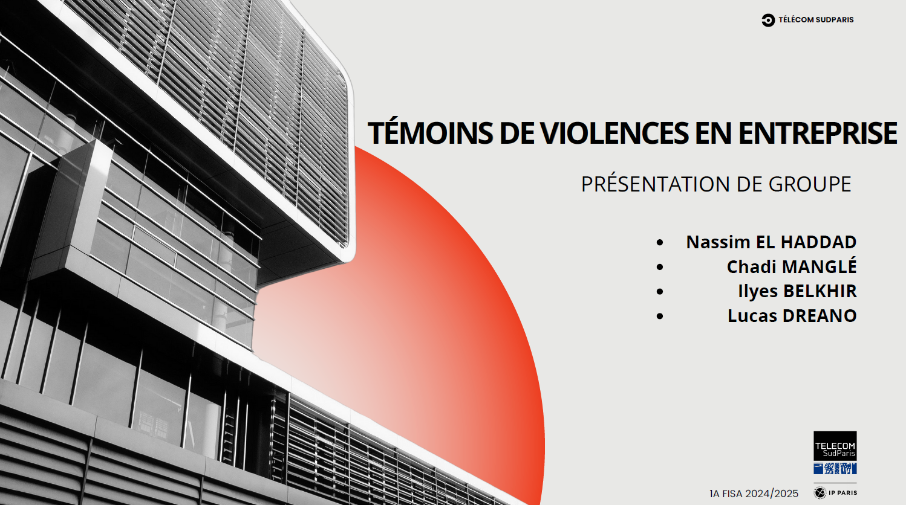

# Présentation du Projet | Project Presentation

## FR :

Ce projet consiste en une présentation de groupe réalisée en cours de management, portant sur les droits des femmes et sur les actions à mener en tant que collaborateur d'une entreprise lorsqu'on soupçonne qu'une collègue pourrait être victime de violences conjugales. Le but est de sensibiliser et d'informer les employés sur la façon de reconnaître les signes de violence domestique et d'intervenir de manière appropriée, en respectant la confidentialité et en suivant les protocoles internes.

### Comment Utiliser

1. Clonez le dépôt sur votre machine locale.
2. Ouvrez le fichier de présentation (`Présentation RH.pdf`) dans un lecteur PDF.
3. Explorez et modifiez le contenu selon vos besoins ou pour l'adapter à d'autres environnements professionnels.

### Technologies Utilisées

- Canva

## ENG :

This project is a group presentation from a management course focused on women's rights and how to act as a colleague if one suspects that a coworker may be experiencing domestic violence. The objective is to raise awareness and educate employees on recognizing signs of domestic abuse and intervening appropriately, while respecting confidentiality and following internal protocols.

### How to Use

1. Clone the repository to your local machine.
2. Open the presentation file (`Présentation RH.pdf`) in a PDF viewer.
3. Explore and modify the content as needed or to adapt it to other professional settings.

### Technologies Used

- Canva

---

## Ce que j'ai appris | What I Learned

## FR :

Ce projet m'a permis d'approfondir mes connaissances sur les droits des femmes dans un cadre professionnel et d'explorer les moyens appropriés pour offrir du soutien à une collègue en difficulté. J'ai aussi développé des compétences en communication et en gestion de situations délicates.

## ENG :

Through this project, I deepened my knowledge of women's rights in a professional context and explored appropriate ways to support a coworker in distress. I also developed skills in communication and handling sensitive situations.

---

## Auteurs | Authors

- [Nassim EL HADDAD](https://www.linkedin.com/in/nassim-elhaddad/)
- [Chadi Manglé](https://www.linkedin.com/in/chadi-mangl%C3%A9-362b08265/)
- [Lucas Dréano](https://www.linkedin.com/in/lucas-dreano-9b3bab259/))
- [Ilyes Belkhir](https://www.linkedin.com/in/ilyes-belkhir/)

---

### Liens Utiles | Useful Links

- [Organisation des Nations Unies - Droits des Femmes](https://www.unwomen.org/fr)

---

### Image

